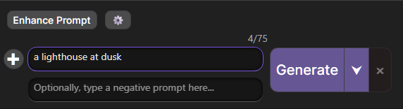
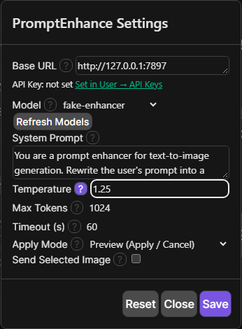
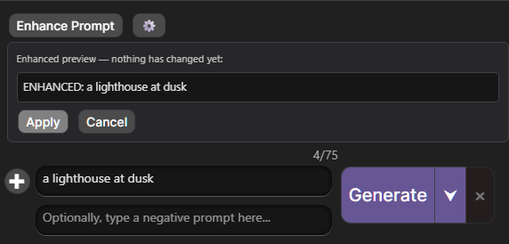
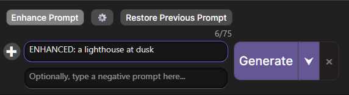
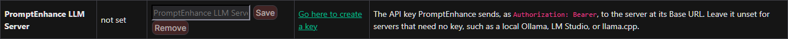

# PromptEnhance

A [SwarmUI](https://github.com/mcmonkeyprojects/SwarmUI) extension that adds an **Enhance Prompt** button to the Generate tab. Clicking it sends the current prompt (and optionally the selected image) to an OpenAI-compatible chat server you configure, such as Ollama, LM Studio, or llama.cpp's server. The server rewrites the prompt into a more detailed one, and the result is shown for approval, appended, or swapped in with a Restore button.



Tested against SwarmUI v0.9.8.3 (commit [`96a4c3d`](https://github.com/mcmonkeyprojects/SwarmUI/commit/96a4c3d14a31776bab5e3300301e078c15875f22)).

## Install

Clone this repository into your SwarmUI checkout's extensions directory, then restart SwarmUI:

```sh
cd <SwarmUI>/src/Extensions
git clone https://github.com/primeinc/SwarmUI-PromptEnhanceExt.git PromptEnhance
```

SwarmUI compiles extensions as part of its own build, so a restart (which rebuilds) is all that is needed. If the extension is listed in Swarm's extension manager (`Server` → `Extensions`), it can also be installed from there.

You also need an OpenAI-compatible chat server. Local servers such as Ollama, LM Studio, and llama.cpp need no key; for a server that does, see [API keys](#api-keys). The default Base URL, `http://localhost:11434`, is Ollama's.

## Usage

1. Open the **Generate** tab. The **Enhance Prompt** button and a ⚙️ settings button sit directly above the prompt box.
2. Click ⚙️ to open **PromptEnhance Settings**. Set the **Base URL** of your server and click **Save**. If the server needs an API key, save it under **User → API Keys** first ([API keys](#api-keys)). Reopen settings (or click **Refresh Models**) to load that server's model list, then pick a **Model** and **Save** again.
3. Type a prompt and click **Enhance Prompt**. While the request runs, the button is disabled and a loading indicator shows.



What happens to the result depends on **Apply Mode**:

| Apply Mode | Result |
| --- | --- |
| **Preview (Apply / Cancel)** (default) | The enhanced text appears in a panel above the prompt, and the prompt itself is untouched. **Apply** replaces the prompt; **Cancel** discards the result. |
| **Append (keep original)** | The enhanced text is added below the original prompt, separated by `---`. |
| **Replace (with Restore button)** | The enhanced text replaces the prompt immediately. |

After a replace (whether from **Apply** in Preview mode or from Replace mode), a **Restore Previous Prompt** button appears. It puts back the prompt as it was before the first enhancement, even after several enhancements in a row.





The screenshots come from the extension's browser tests, which run it against a stub server that answers `ENHANCED: <your prompt>`. A real model returns a rewritten prompt.

**Send Selected Image** attaches the image currently selected on the Generate tab to the request, which needs a vision-capable model. With no image selected, the request is text-only.

Settings are saved per user, on the server. Each field in the settings modal has a **?** popover describing it.

### Troubleshooting

Errors from **Enhance Prompt** appear in SwarmUI's error banner. Errors in the settings modal appear in red at the bottom of the modal.

| Message | Fix |
| --- | --- |
| `Type a prompt to enhance first.` | The prompt box is empty. |
| `Cannot reach the LLM backend…` | The server is not running, or the Base URL is wrong. |
| The model list shows **Error loading models** | The model-list request failed. The red status line at the bottom of the modal gives the reason: an unreachable server, a missing or wrong API key, or a Base URL that is not an OpenAI-compatible server. The stored model is kept until you pick another. |
| `The backend answered 307 redirecting to …` | The server redirected the request. PromptEnhance does not follow redirects; set the Base URL to the address in the message. |
| `No usable model…` | No model is selected, or the server does not have it loaded. |
| `Base URL must be a valid http(s) URL…` | Save rejected the Base URL; use an absolute URL such as `http://localhost:11434`. |
| `The LLM backend rejected the request as unauthorized…` | The server needs an API key, or the saved one is wrong. Set it under **User → API Keys**; see [API keys](#api-keys). The server's own reason follows under **Detail**. |
| `The saved PromptEnhance API key contains spaces, line breaks, or non-ASCII characters…` | Re-enter the key under **User → API Keys**; a stray character was likely pasted with it. It was not sent. |
| `The selected model rejected the attached image…` | Use a vision model, or turn off **Send Selected Image**. |
| `The request to the LLM backend timed out…` | Raise **Timeout (s)**, or use a faster model. |

## Permissions

The extension registers two permission nodes, both defaulting to the `POWERUSERS` role with the `POWERFUL` safety level:

| Node | Gates |
| --- | --- |
| `promptenhance_use_backend` | Outbound calls to the configured OpenAI-compatible backend: the `PromptEnhanceListModels` and `PromptEnhanceRun` API routes. |
| `promptenhance_config` | Reading, saving, and resetting PromptEnhance settings: the `GetPromptEnhanceSettings`, `SavePromptEnhanceSettings`, and `ResetPromptEnhanceSettings` API routes. |

Users without `promptenhance_use_backend` cannot cause the server to make any network connection through this extension. Users without `promptenhance_config` cannot change where those connections go.

## Connections

This extension makes outbound web connections **only to the base URL configured in its settings** (default `http://localhost:11434`), and only when a permitted user triggers an action. Exactly three requests exist, touching only two paths under the base URL:

| Request | When | What |
| --- | --- | --- |
| `GET {baseUrl}/v1/models` | Before every model-list or enhance call | Reachability probe. Only transport failures (connection refused, DNS) count as unreachable; no response within 3 seconds counts as reachable and the real call proceeds under `timeoutSeconds`. Results are cached (10s reachable, 30s unreachable). |
| `GET {baseUrl}/v1/models` | When the settings modal opens or refreshes the model list | Model discovery for the model dropdown. Carries the API key, if one is set. |
| `POST {baseUrl}/v1/chat/completions` | When the user clicks Enhance | The enhance call. Carries the API key, if one is set. Sends the configured system prompt, the user's prompt text, and — only if `sendSelectedImage` is enabled — the currently selected Generate-tab image as base64. |

The reachability probe never carries the key. No other hosts are ever contacted, and no path other than `/v1/models` and `/v1/chat/completions` is ever requested:
- Redirects are not followed; a 3xx answer is reported as an error naming its target.
- A Base URL with a query (`?`), a fragment (`#`), or a user name and password is rejected when saved, since those would change the path or host the fixed `/v1/...` suffix reaches.

There is no telemetry, no update check, and no analytics of any kind.

## Settings

Settings are stored per-user through SwarmUI's user-data store. **Reset** in the settings modal restores every key to its default. The eight keys and their defaults:

| Key | Default | Meaning |
| --- | --- | --- |
| `baseUrl` | `http://localhost:11434` | Root URL of the OpenAI-compatible server. A trailing `/v1` is accepted and stripped; must be an absolute http(s) URL. |
| `model` | `""` | Model id sent in the chat request. Must be selected before enhancing. |
| `timeoutSeconds` | `60` | Per-request timeout for the model-list and enhance calls, 1 to 3600. |
| `systemPrompt` | `You are a prompt enhancer for text-to-image generation. Rewrite the user's prompt into a single, richly detailed image-generation prompt. Reply with only the enhanced prompt, no preamble or explanation.` | System message sent with every enhance call. |
| `temperature` | `0.7` | Sampling temperature, 0 to 2. |
| `maxTokens` | `1024` | `max_tokens` for the chat completion. |
| `sendSelectedImage` | `false` | When enabled, attaches the currently selected Generate-tab image to the enhance request. Requires a vision-capable model. |
| `replaceMode` | `preview` | How the enhanced prompt is applied: `preview`, `append`, or `replace_with_restore`. |

## API keys

For a server that requires a key, such as a hosted OpenAI-compatible API or an authenticating proxy, save the key in SwarmUI's own key store. Open **User → User Info → API Keys**, paste the key into the **PromptEnhance LLM Server** row, and click **Save**. The settings modal shows whether a key is saved, with a link to that row.



- The key is sent as `Authorization: Bearer <key>` on the model-list and enhance requests to the Base URL, and nowhere else.
- It is stored per user on the SwarmUI server and is never sent back to the browser. The User tab and the settings modal show only *not set* or *last updated &lt;time&gt;*.
- **Remove** in the same row deletes it. With no key saved, no `Authorization` header is sent.
- The key goes to whatever Base URL is configured. For a remote server, use an `https://` Base URL so the key is not sent in clear text.

Saving a key uses SwarmUI's `edit_user_settings` permission. Changing where the key goes (the Base URL) needs `promptenhance_config`.

## Development

### Prerequisites

- .NET 8 SDK
- Node.js 22.18 or newer (the UI tooling runs `.mts` files directly)
- [`just`](https://github.com/casey/just) 1.56 or newer, for the recipes below
- Windows recipes run in PowerShell; Unix recipes in `sh` with `rsync` and `perl`

### Layouts

Two layouts build and test identically; the C# project picks one automatically (`UseVendoredSwarmUI` in `PromptEnhance.csproj`):

1. **Host layout** — the checkout lives at `<SwarmUI>/src/Extensions/PromptEnhance` and imports SwarmUI's canonical `SwarmUI.extension.props`. `scripts/run-tests.sh` (requires `SWARMUI_ROOT`) runs every committed gate in this layout.
2. **Standalone workspace** — the checkout lives anywhere, with the SwarmUI host vendored at `./vendor/SwarmUI`, pinned to the same commit CI builds (`swarmui_pin` in the `justfile`, mirrored by every SwarmUI ref in `.github/workflows/gates.yml`). Set up with `just vendor-sync`; move the pin only with `just vendor-bump <sha>`. The vendored property group in `PromptEnhance.csproj` mirrors `SwarmUI.extension.props`, and a test fails if they drift.

### Source layout

| Path | Contents |
| --- | --- |
| `PromptEnhanceExtension.cs` | Entry point: registers the scripts, stylesheet, and API routes. |
| `WebAPI/` | The five API routes, the backend HTTP client, settings storage and validation, the error taxonomy, and the API key registration (`UpstreamApiKey.cs`). Every route carries `[API.APIDescription]`/`[API.APIParameter]` for SwarmUI's API doc generator, and failures return SwarmUI's `{ "error", "error_id" }` envelope with `error_id` from `errorCategories` in the contract. |
| `Frontend/*.ts` | The browser code, authoritative. Classic global scripts built on SwarmUI's own helpers (`util.js`, `site.js`); every global is `pe`-prefixed or a `promptEnhance*` singleton. |
| `Assets/*.js` | The exact `tsc` output of `Frontend/`, committed because SwarmUI serves it. Never edit by hand; `npm run build:frontend` regenerates it. |
| `Assets/promptenhance.css` | Extension styles, using only color tokens every SwarmUI theme defines. |
| `contracts/pe-contract.json` | Routes, setting defaults, bounds, and apply modes, shared by the C# and TypeScript sides; parity tests pin both to it. |
| `Tests/*.cs` | C# suite (xunit.v3) against the real SwarmUI assembly. |
| `Tests/frontend/` | jsdom suite: the emitted `Assets/*.js` plus the host's `util.js`, with the host's request and layout hooks stubbed. |
| `Tests/ui/` | Playwright browser gates against the real vendored host and a fake OpenAI-compatible backend. |
| `screenshots/` | README screenshots and their freshness manifest. |

### Gates

`just check` is the gate to run before committing. It runs, in order:

```sh
npm run check:frontend-parity   # Frontend/*.ts is authoritative; committed Assets/*.js must be its exact tsc output
npm run lint                    # Biome, recommended preset; Frontend keeps SwarmUI style (let, ==)
npm run shots:check             # ./screenshots must be what a green browser run of the current UI produced
npm run test:frontend           # compiled TypeScript tests against the emitted Assets/*.js and the host util.js, real jsdom
dotnet test Tests/PromptEnhance.Tests.csproj -c Debug   # C# suite, VSTest path (zero-test runs fail via Tests/.runsettings)
dotnet test Tests/PromptEnhance.Tests.csproj -c Debug -p:TestingPlatformDotnetTestSupport=true   # C# suite, Microsoft Testing Platform via dotnet test
dotnet run --project Tests/PromptEnhance.Tests.csproj -c Debug   # C# suite, stand-alone MTP test executable
```

The parity check diffs against the git index, so stage the rebuilt `Assets/*.js` before running it.

CI (`.github/workflows/gates.yml`) runs these gates on every push, the C# suite in both layouts, plus a `browser` job: the live host boot (`just vendor-ci-test`) and every browser gate. The browser job skips the pixel comparison of `screenshots/`, since fonts render differently on the Linux runners; `shots:check` still holds the screenshots to the current inputs there.

### Running the real host

These recipes need the standalone workspace:

| Recipe | What it does |
| --- | --- |
| `just vendor-dev` | Seeds a minimal no-backend `Data/Settings.fds` and copies this extension into the vendored host's `src/Extensions/`. |
| `just vendor-ci-test` | Boots the real host with SwarmUI's `--ci_test` mode; any logged error fails with a nonzero exit. |
| `just ui-install` | Downloads the Chromium build Playwright drives (once). |
| `just ui-test` | The browser gates, skipped in under a second when nothing they depend on changed since the last green run. |
| `just ui-test-force` | Always runs them: rebuilds the frontend and host, starts the host on port 7898 and the fake backends on ports 7897 (no key) and 7896 (key required), and runs `Tests/ui/*.spec.ts` in headless Chromium. Diagnostic screenshots land in `Tests/ui/shots/`, including one per SwarmUI theme. README screenshots that visibly changed are rewritten in `screenshots/`, and a fully green run records `screenshots/manifest.json`. |

The browser gates cover:
- the prompt-box geometry: the extension bar and preview never push the prompt boxes under the bottom panel
- a clean console on startup
- the preview, append, and Restore flows
- every settings-modal path: listing models, saving, server-side rejection, an unreachable backend, Reset, and the apply-mode labels
- API keys, against a fake server that answers only the right bearer key: refused without a key, refused with a wrong one, answered after the key is saved through the real User → API Keys row, and the key absent from every response the browser receives
- the extension's borders and the modal in every registered theme

### README screenshots

The PNGs in `screenshots/` are Playwright `toHaveScreenshot` baselines. On the default ports a browser run compares them pixel by pixel with no differing pixel allowed, so a single changed character is a difference. Other ports skip the comparison, since the settings modal shows the port values. A plain `npm run test:ui` fails on a difference. `just ui-test` and `just ui-test-force` run with `--update-snapshots=changed`, which rewrites the differing PNG instead of failing, so a visual change shows up in `git diff screenshots/` for review. An unchanged UI leaves `screenshots/` untouched.

`screenshots/manifest.json` records:
- each screenshot's sha256
- the SwarmUI pin
- a digest of everything the browser gates depend on: `Frontend/`, `Assets/`, `WebAPI/`, the root C# files and csproj, `contracts/`, `Tests/ui/`, the dev host seed, and the npm lockfile

Only the gate writes it, and only after a run that passed in full, unfiltered, on the default ports, against a clean vendored host at the pin, with no input changing mid-run. `npm run shots:check` fails when:
- a screenshot differs from the one recorded, or is added or missing
- any input or the pin changed since that run
- the README does not show a recorded screenshot

The manifest guards against committing stale screenshots by accident. It is not tamper-proof.

The fix is always `just ui-test`, then commit `screenshots/`. Removing a screenshot from the specs does not delete its PNG; delete it and the README reference in the same change.

## License

MIT — see [LICENSE](LICENSE).
